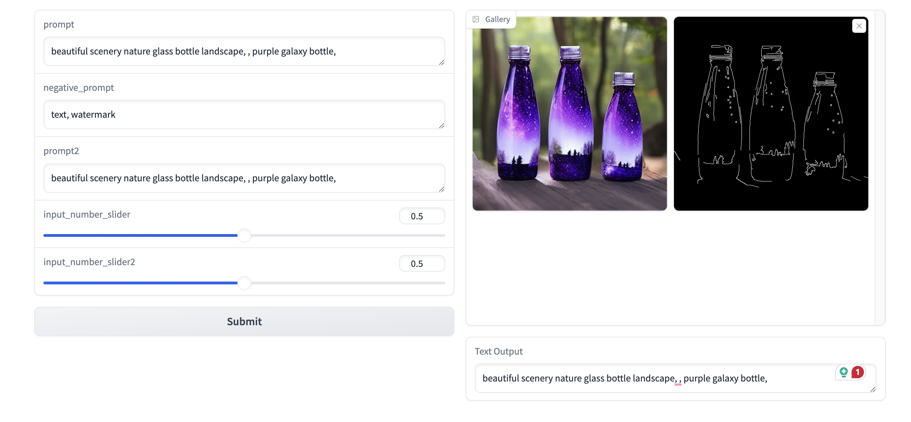

# ComfyDeploy Gradio Interface

This project provides a Gradio interface for interacting with ComfyDeploy, allowing users to dynamically generate UI components based on deployment input definitions and submit jobs to ComfyDeploy.



## Features

- Dynamic UI generation based on ComfyDeploy input definitions
- Support for various input types (text, image, number, checkbox, etc.)
- Asynchronous job submission to ComfyDeploy
- Real-time progress tracking
- Display of output images and text

## Installation

1. Clone this repository
2. Install the required dependencies:

```bash
pip install comfydeploy gradio pillow requests python-dotenv
```

3. Create a `.env` file in the project root with the following content:

```
API_KEY=your_comfydeploy_api_key
DEPLOYMENT_ID=your_deployment_id
```

## Usage

Run the main script:

```bash
python main.py
```

This will launch a Gradio interface in your default web browser. The interface will dynamically generate input components based on your ComfyDeploy deployment configuration. You can then input values and submit jobs to ComfyDeploy.

## How it works

1. The script fetches input definitions from ComfyDeploy.
2. It dynamically generates Gradio components based on these definitions.
3. When the user submits inputs, it sends a job to ComfyDeploy.
4. The script then polls for job completion and displays the results (images and text).

## Contributing

Pull requests are welcome. For major changes, please open an issue first to discuss what you would like to change.

## License

[MIT](https://choosealicense.com/licenses/mit/)